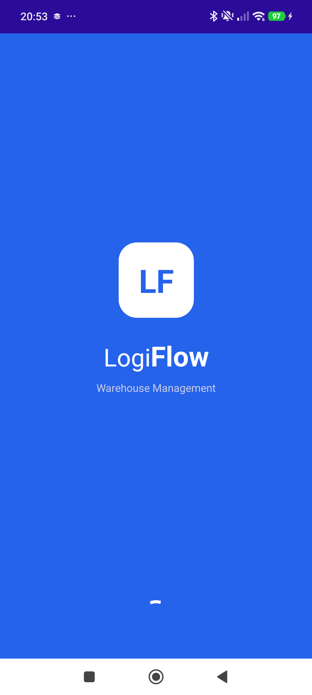
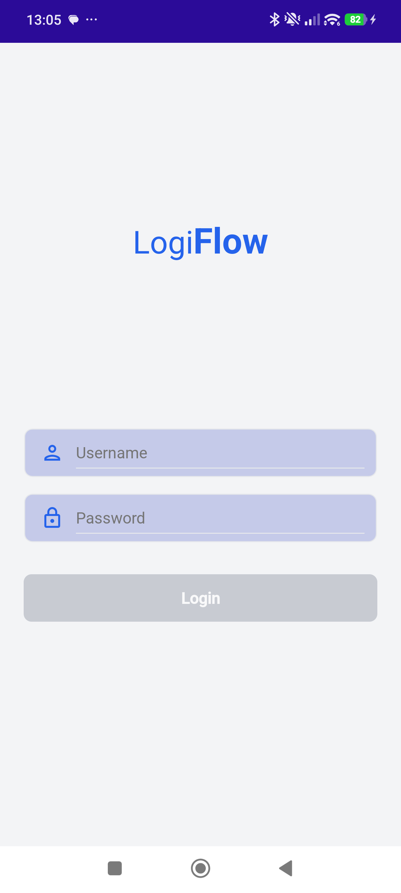
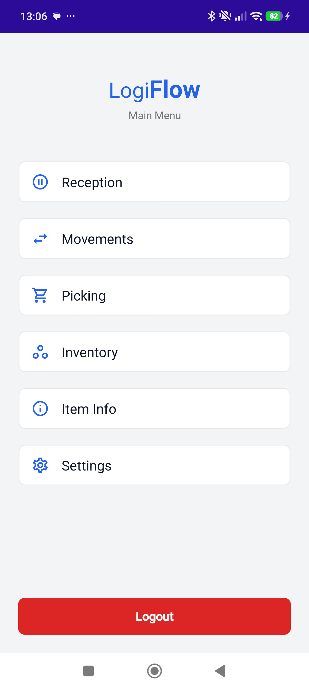
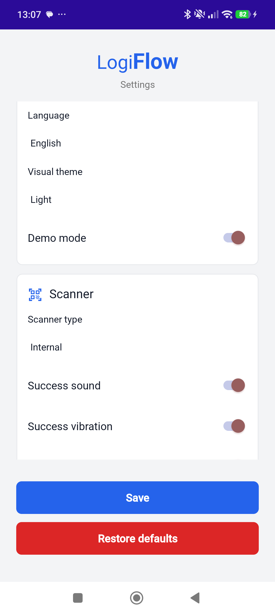
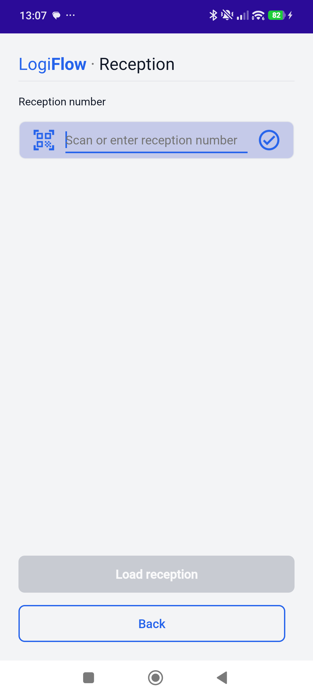
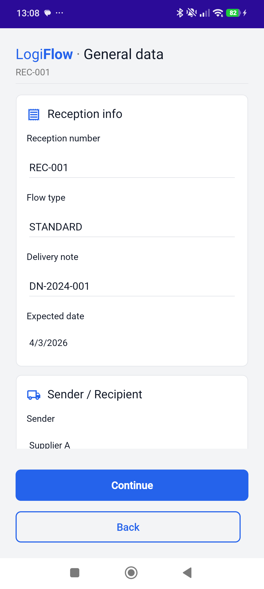
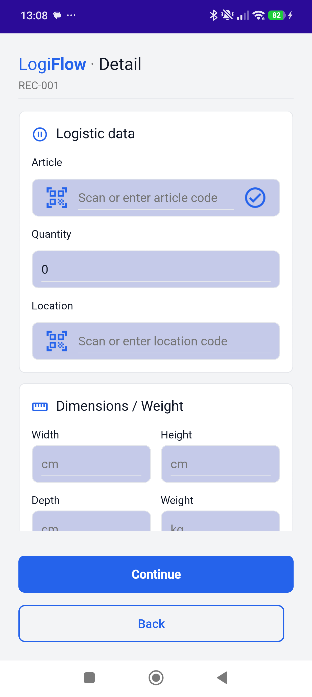
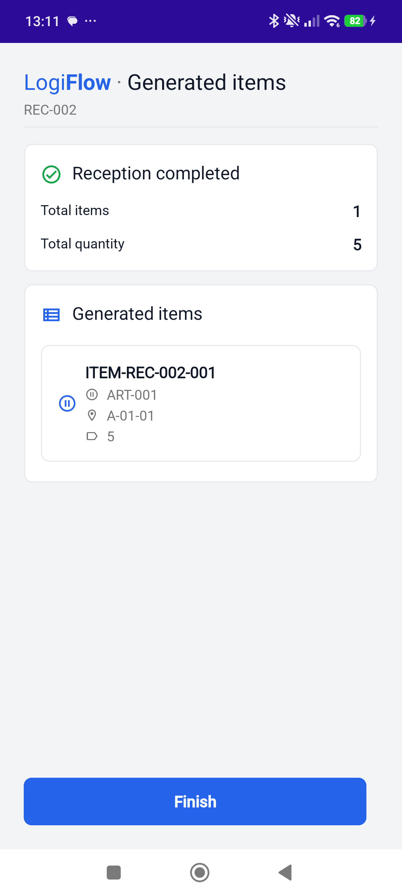
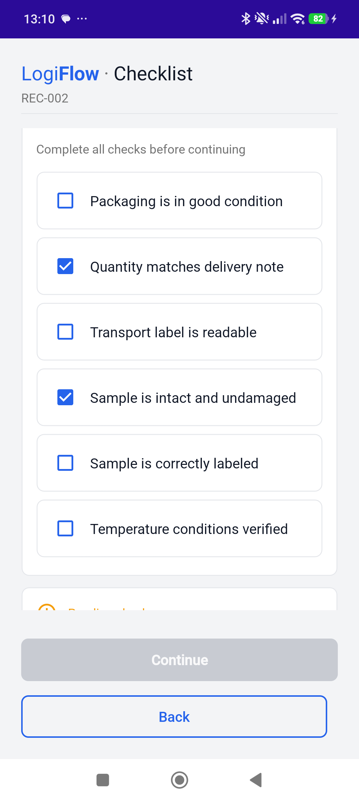

# LogiFlow Mobile

> Warehouse Management System mobile application built with .NET MAUI


## Overview

LogiFlow Mobile is a professional warehouse management application designed for industrial environments. Built with .NET MAUI, it provides a cross-platform solution for warehouse operations including reception, movements, picking, and inventory management.

The project follows enterprise-grade development practices including MVVM architecture, dependency injection, comprehensive unit testing, and a full CI/CD pipeline with automated distribution.

## Screenshots

<p align="center">
  
  &nbsp;&nbsp;&nbsp;&nbsp;
  
  &nbsp;&nbsp;&nbsp;&nbsp;
  
  &nbsp;&nbsp;&nbsp;&nbsp;
  
</p>
<p align="center">
  
  &nbsp;&nbsp;&nbsp;&nbsp;
  
  &nbsp;&nbsp;&nbsp;&nbsp;
  
  &nbsp;&nbsp;&nbsp;&nbsp;
  
  &nbsp;&nbsp;&nbsp;&nbsp;
  
</p>

## Features

- **Authentication** — Secure login with session management
- **Main Menu** — Quick access to all warehouse modules
- **Settings** — Configurable server URL, scanner type, language and visual theme
- **Internationalization** — Full English and Spanish support with real-time language switching
- **Reception** — Full goods reception flow with barcode scanning, checklist and item generation
- **Offline-ready architecture** — Service layer designed for easy API integration

## Modules

| Module | Description | Status |
|--------|-------------|--------|
| Reception | Goods reception and validation | ✅ Complete |
| Movements | Stock movements between locations | 🚧 In progress |
| Picking | Order picking operations | 🚧 In progress |
| Inventory | Stock counting and verification | 🚧 In progress |
| Item Info | Product information lookup | 🚧 In progress |
| Settings | App configuration | ✅ Complete |

## Architecture
```
LogiFlow.Mobile/
├── Converters/          # XAML value converters
├── DTOs/                # Data transfer objects
├── Exceptions/          # Custom domain exceptions
├── Extensions/          # XAML markup extensions
├── Models/              # Domain models
├── Platforms/           # Platform-specific code
├── Resources/
│   ├── AppIcon/         # App icon
│   ├── Fonts/           # Custom fonts
│   ├── Icons/           # Material icons system
│   ├── Images/          # Image assets
│   ├── Languages/       # Localization (.resx)
│   ├── Splash/          # Splash screen
│   └── Styles/          # Global styles and Design System
├── Services/
│   ├── Implementations/ # Service implementations
│   └── Interfaces/      # Service contracts
├── ViewModels/          # MVVM ViewModels
└── Views/               # XAML Pages
```

## Tech Stack

| Technology | Purpose |
|------------|---------|
| .NET MAUI 9 | Cross-platform mobile framework |
| CommunityToolkit.MAUI | UI components and behaviors |
| CommunityToolkit.Mvvm | MVVM pattern implementation |
| Serilog | Structured logging |
| xUnit + Moq | Unit testing |
| coverlet | Code coverage |

## CI/CD Pipeline

Every push to `main` automatically:

1. ✅ Runs 439 unit tests
2. ✅ Builds the Android APK in Release mode
3. ✅ Distributes to testers via Firebase App Distribution

Built with **GitHub Actions** and **Firebase App Distribution**.

## Getting Started

### Prerequisites

- Visual Studio 2022 17.8+
- .NET 9 SDK
- .NET MAUI workload
- Android SDK

### Run locally
```bash
git clone https://github.com/Djeda8/LogiFlow.Mobile.git
cd LogiFlow.Mobile
dotnet restore
dotnet build
```

### Run tests
```bash
dotnet test LogiFlow.Mobile.Tests/LogiFlow.Mobile.Tests.csproj
```

## Design System

The app follows a strict Design System for consistency across all modules:

- **Primary color**: `#2563EB` (Industrial Blue)
- **Error color**: `#DC2626`
- **Success color**: `#16A34A`
- **Warning color**: `#F59E0B`
- **Typography**: Roboto
- **Icons**: Material Icons Outlined

Designed for industrial environments with large touch targets (min 48px), high contrast, and clear visual feedback for all states.

**Theme support**: Full dark/light mode with runtime switching. User preference persisted across sessions. Entry underline, cursor, and selection colors adapt to active theme in real-time. Icons update on theme change.

## License

This project is licensed under the MIT License — see the [LICENSE](LICENSE) file for details.

---

*Built by [Daniel Ojeda Ubeda](https://github.com/Djeda8)*
